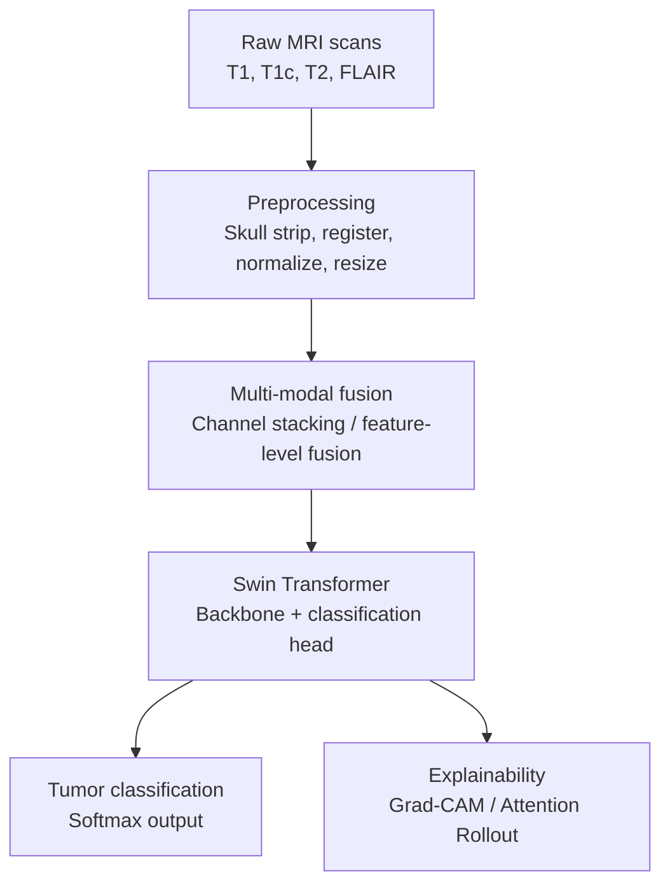

# Explainable Brain Tumor Diagnosis Using Vision Transformers and Multi-Modal MRI Fusion

An explainable deep learning pipeline for brain tumor classification from multi-modal MRI scans, built on a **Swin Transformer** backbone with integrated visual explainability (Grad-CAM / Attention Rollout).

---

## Table of Contents

- [Overview](#overview)
- [Key Features](#key-features)
- [Project Motivation](#project-motivation)
- [System Architecture](#system-architecture)
- [Dataset](#dataset)
- [Methodology](#methodology)
- [Installation](#installation)
- [Usage](#usage)
- [Project Structure](#project-structure)
- [Results](#results)
- [Explainability](#explainability)
- [Tech Stack](#tech-stack)
- [Roadmap](#roadmap)
- [Contributing](#contributing)
- [License](#license)
- [Citation](#citation)
- [Acknowledgements](#acknowledgements)

---

## Overview

Brain tumors are among the most life-threatening neurological conditions, and early, accurate diagnosis from MRI scans is critical for treatment planning. Radiologists typically examine **multiple MRI modalities** (T1, T1-contrast, T2, FLAIR) together, since each sequence highlights different tissue characteristics.

This project builds a deep learning system that:

1. **Fuses multiple MRI modalities** into a single, information-rich input.
2. Classifies the tumor type using a **Swin Transformer**, a state-of-the-art hierarchical vision transformer that captures both local detail and global context efficiently.
3. Produces **visual explanations** (heatmaps) for every prediction, so clinicians can verify that the model is focusing on medically relevant regions rather than spurious artifacts.

The goal is a diagnostic-support tool that is both **accurate** and **trustworthy** — not a black box.

---

## Key Features

- **Multi-modal MRI fusion** — combines T1, T1c, T2, and FLAIR sequences for richer input representation.
- **Swin Transformer backbone** — hierarchical shifted-window self-attention for efficient, high-resolution medical image classification.
- **Transfer learning** — fine-tunes ImageNet-pretrained Swin weights on brain MRI data.
- **Explainable AI (XAI)** — Grad-CAM and Attention Rollout overlays to visualize model reasoning.
- **Modular pipeline** — clean separation of preprocessing, fusion, model, training, and explainability code.
- **Reproducible experiments** — configuration-driven training with logged metrics.
- **Deployment-ready demo** — simple Streamlit/Flask app for uploading scans and viewing predictions with heatmaps.

---

## Project Motivation

Deep learning models achieve strong accuracy on medical imaging tasks, but clinical adoption is limited by their **lack of transparency**. A model that predicts "glioma" with 92% confidence is not clinically useful unless a radiologist can see *why* it made that decision. This project directly addresses that gap by pairing a high-performing Swin Transformer classifier with interpretable visual explanations, aiming to bridge the trust gap between AI systems and clinical practitioners.

---

## System Architecture



The pipeline moves from raw multi-sequence MRI input through preprocessing and fusion, into the Swin Transformer backbone, which produces both a tumor classification and a visual explanation for that prediction.
---

## Dataset

This project is designed to work with public multi-modal brain MRI datasets, such as:

- **BraTS (Brain Tumor Segmentation Challenge)** — multi-institutional dataset with T1, T1c, T2, and FLAIR sequences and expert-annotated tumor sub-regions.
- **Kaggle Brain Tumor MRI Dataset** — classification-oriented dataset (glioma, meningioma, pituitary, no tumor).

> **Note:** Datasets are not included in this repository due to size and licensing restrictions. Please download them from their official sources and place them under `data/raw/` following the structure described in [`data/README.md`](data/README.md).

| Class       | Description                              |
|-------------|-------------------------------------------|
| Glioma      | Tumor arising from glial cells            |
| Meningioma  | Tumor arising from the meninges           |
| Pituitary   | Tumor in the pituitary gland               |
| No Tumor    | Healthy control scan                       |

---

## Methodology

1. **Preprocessing** — skull stripping, spatial registration across modalities, intensity normalization, and resizing to 224×224.
2. **Fusion** — modalities are stacked as a 4-channel tensor (early fusion) or encoded separately and merged at the feature level (late fusion).
3. **Modeling** — a pretrained Swin Transformer (`swin_tiny` / `swin_base`) is fine-tuned with a modified input stem (4 channels) and a custom classification head.
4. **Training** — cross-entropy loss, AdamW optimizer, cosine learning-rate schedule, data augmentation (flips, rotations, elastic deformation), and patient-level train/validation/test splitting to avoid data leakage.
5. **Evaluation** — accuracy, precision, recall, F1-score, AUC, and confusion matrix.
6. **Explainability** — Grad-CAM and Attention Rollout heatmaps overlaid on the original MRI slices.

---

## Installation

\```bash
# Clone the repository
git clone https://github.com/<your-username>/explainable-brain-tumor-swin.git
cd explainable-brain-tumor-swin

# Create and activate a virtual environment
python -m venv venv
source venv/bin/activate      # On Windows: venv\Scripts\activate

# Install dependencies
pip install -r requirements.txt
\```

### Requirements

- Python 3.9+
- PyTorch >= 2.0
- torchvision / timm
- numpy, pandas, scikit-learn
- opencv-python, nibabel, SimpleITK (for MRI/NIfTI handling)
- matplotlib, seaborn
- grad-cam (pytorch-grad-cam)
- streamlit (for the demo app)

Full list in [`requirements.txt`](requirements.txt).

---

## Usage

### 1. Preprocess the dataset
\```bash
python src/preprocessing/prepare_data.py --input_dir data/raw --output_dir data/processed
\```

### 2. Train the model
\```bash
python src/train.py --config configs/swin_config.yaml
\```

### 3. Evaluate on the test set
\```bash
python src/evaluate.py --checkpoint checkpoints/best_model.pth
\```

### 4. Generate explainability heatmaps
\```bash
python src/explain.py --checkpoint checkpoints/best_model.pth --image_path samples/example.nii
\```

### 5. Launch the demo app
\```bash
streamlit run app/app.py
\```

---

## Project Structure

```
explainable-brain-tumor-swin/
├── data/
│   ├── raw/                  # Original downloaded datasets (not included)
│   └── processed/            # Preprocessed and fused MRI tensors
├── src/
│   ├── preprocessing/        # Skull stripping, registration, normalization
│   ├── fusion/                # Multi-modal fusion logic
│   ├── models/                 # Swin Transformer model definitions
│   ├── train.py                 # Training loop
│   ├── evaluate.py              # Evaluation metrics
│   └── explain.py               # Grad-CAM / Attention Rollout
├── app/
│   └── app.py                    # Streamlit demo application
├── configs/
│   └── swin_config.yaml           # Training hyperparameters
├── checkpoints/                    # Saved model weights
├── notebooks/                       # Exploratory analysis notebooks
├── requirements.txt
├── LICENSE
└── README.md
```
---

## Results

| Model              | Accuracy | Precision | Recall | F1-score | AUC   |
|--------------------|----------|-----------|--------|----------|-------|
| Swin-Tiny (single-modality) | –   | –         | –      | –        | –     |
| Swin-Tiny (multi-modal fusion) | – | –       | –      | –        | –     |
| Swin-Base (multi-modal fusion) | – | –       | –      | –        | –     |

> Replace with your actual experiment results once training is complete. Include a confusion matrix and ROC curves in `results/`.

---

## Explainability

Every prediction is accompanied by a heatmap that highlights the regions of the MRI the model relied on most heavily. This is generated using:

- **Grad-CAM** — gradient-based class activation mapping adapted for transformer architectures.
- **Attention Rollout** — aggregates self-attention weights across all Swin Transformer layers to produce a saliency map.

Example output (prediction + heatmap overlay) will be shown here:

\```
[ MRI Slice ]   [ Predicted: Glioma, 94.2% ]   [ Grad-CAM Heatmap Overlay ]
\```

---

## Tech Stack

- **Deep Learning:** PyTorch, timm
- **Vision Backbone:** Swin Transformer
- **Explainability:** pytorch-grad-cam, custom Attention Rollout
- **Medical Imaging:** nibabel, SimpleITK, OpenCV
- **Deployment:** Streamlit / Flask
- **Experiment Tracking:** TensorBoard / Weights & Biases (optional)

---

## Roadmap

- [ ] Add segmentation head (tumor boundary delineation) alongside classification
- [ ] Support 3D volumetric Swin Transformer (Swin-UNETR style)
- [ ] Add SHAP-based feature attribution
- [ ] Dockerize the full pipeline
- [ ] Deploy demo app publicly (e.g., Hugging Face Spaces)

---

## Contributing

Contributions are welcome. Please open an issue to discuss significant changes before submitting a pull request.

1. Fork the repository
2. Create a feature branch (`git checkout -b feature/your-feature`)
3. Commit your changes (`git commit -m "Add your feature"`)
4. Push to the branch (`git push origin feature/your-feature`)
5. Open a Pull Request

---

## License

This project is licensed under the **MIT License** — see the [LICENSE](LICENSE) file for details.

---

## Citation

If you use this work in your research, please cite it as:

\```bibtex
@misc{brain_tumor_swin_2026,
  title  = {Explainable Brain Tumor Diagnosis Using Vision Transformers and Multi-Modal MRI Fusion},
  author = {Your Name},
  year   = {2026},
  howpublished = {\url{https://github.com/<your-username>/explainable-brain-tumor-swin}}
}
\```

---

## Acknowledgements

- The **BraTS Challenge** organizers for providing multi-modal MRI benchmark datasets.
- The original **Swin Transformer** authors (Liu et al., 2021) for the backbone architecture.
- The open-source explainable AI community for Grad-CAM and Attention Rollout implementations.

---

*Disclaimer: This project is intended for research and educational purposes only and is not a certified medical diagnostic tool. It should not be used for actual clinical decision-making without appropriate regulatory approval and validation.*
