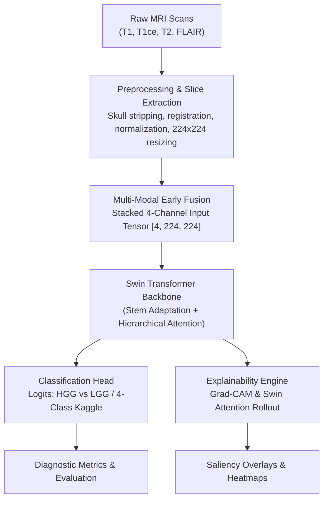

# Explainable Brain Tumor Diagnosis Using Vision Transformers and Multi-Modal MRI Fusion

[](https://www.python.org/)
[](https://pytorch.org/)
[](https://github.com/microsoft/Swin-Transformer)
[](LICENSE)

An explainable deep learning pipeline for brain tumor classification from multi-modal MRI scans, built on a **Swin Transformer** backbone with integrated visual explainability (Grad-CAM / Attention Rollout).

---

## Table of Contents

- [Overview](#overview)
- [Key Features](#key-features)
- [Project Motivation](#project-motivation)
- [System Architecture](#system-architecture)
- [Dataset](#dataset)
- [Methodology](#methodology)
- [Experimental Results](#experimental-results)
- [Explainability (XAI)](#explainability-xai)
- [Installation](#installation)
- [Usage](#usage)
- [Project Structure](#project-structure)
- [Tech Stack](#tech-stack)
- [Roadmap](#roadmap)
- [License](#license)
- [Citation](#citation)
- [Acknowledgements](#acknowledgements)

---

## Overview

Brain tumors are among the most life-threatening neurological conditions, and early, accurate diagnosis from MRI scans is critical for treatment planning. Radiologists typically examine **multiple MRI modalities** (T1, T1-contrast, T2, FLAIR) together, since each sequence highlights different tissue characteristics.

This project builds a deep learning system that:

1. **Fuses multiple MRI modalities** (T1, T1ce, T2, FLAIR) into a single, 4-channel stacked input representation (early fusion).
2. Classifies tumor grade/type using a **Swin Transformer**, a state-of-the-art hierarchical vision transformer that captures both local detail and global context efficiently.
3. Addresses severe class imbalance (HGG vs LGG) using **Class-Weighted Cross-Entropy Loss** and **Weighted Random Sampling**.
4. Produces **visual explanations** (heatmaps via Grad-CAM and Swin Attention Rollout) for every prediction, enabling clinicians to verify that the model relies on true tumor tissue.

---

## Key Features

- **Multi-Modal MRI Fusion** — Stacked 4-channel fusion (T1, T1ce, T2, FLAIR) for comprehensive lesion characterization.
- **Hierarchical Swin Transformer** — Shifted-window self-attention backbones (`swin_tiny` and `swin_base`) adapted for multi-channel inputs.
- **Pretrained Stem Adaptation** — Channel-wise weight mean initialization for the 4th channel stem projection layer, preserving scale and stability during transfer learning.
- **Class-Imbalance Mitigation** — Loss weighting combined with `WeightedRandomSampler` mini-batch balancing, boosting minority (LGG) recall from 0.00% to **87.50%**.
- **Visual Explainability (XAI)** — Integrated Grad-CAM and Swin Attention Rollout overlays for transparent model reasoning.
- **Mentor-Ready Documentation** — Complete epoch-by-epoch CSV logs, metrics reports, and training curves archived under [`results/training_documentation/`](results/training_documentation/FINAL_RESULTS_SUMMARY.md).

---

## Project Motivation

Deep learning models achieve strong accuracy on medical imaging tasks, but clinical adoption is limited by their **lack of transparency**. A model that predicts "HGG" or "Glioma" with high confidence is not clinically actionable unless a radiologist can see *why* it made that decision. This project directly addresses that gap by pairing high-performing Swin Transformer classifiers with interpretable visual explanations, bridging the trust gap between AI systems and clinical practitioners.

---

## System Architecture



---

## Dataset

This project supports multi-modal benchmark datasets and single-modality clinical classification sets:

- **BraTS 2020 (Brain Tumor Segmentation Challenge)** — 3,920 multi-modal MRI slices across 140 patients (79.3% HGG / 20.7% LGG). Split strictly at the **patient level** (70% train / 15% val / 15% test) to prevent data leakage across slices.
- **Kaggle Brain Tumor MRI Dataset** — 4-class single-modality dataset (Glioma, Meningioma, Pituitary, No Tumor) with 1,600 held-out test slices.

> [!NOTE]
> Raw data is not stored in this repository due to licensing restrictions. Download instructions and dataset split specifications are located in [`data/README.md`](data/README.md) and [`data/processed/brats_splits.csv`](data/processed/brats_splits.csv).

---

## Methodology

1. **Preprocessing & Registration** — Modal registration, intensity normalization, and 224×224 spatial resizing across sequence volumes.
2. **Early Fusion Stem Adaptation** — Modalities stacked as a `[4, 224, 224]` tensor. Pretrained ImageNet RGB weights copied for channels 0–2, and 4th channel (FLAIR) initialized with channel-wise weight mean (`old_weights.mean(dim=1)`).
3. **Imbalance-Aware Training** — AdamW optimizer with cosine learning rate scheduling ($3 \times 10^{-5}$ for Swin-Tiny, $1.5 \times 10^{-5}$ for Swin-Base), loss weights ($2.45$ LGG / $0.628$ HGG), and balanced `WeightedRandomSampler` batching.
4. **Evaluation Benchmark** — Evaluated on held-out test sets using Accuracy, Precision, Recall, F1-Score, and ROC-AUC.

---

## Experimental Results

Below are the final, verified test set evaluation results across all primary model configurations:

| Model Architecture | Dataset & Experiment | Epochs | Best Val Accuracy | Test Accuracy | Test F1-Score (Target / Macro) | Test AUC | Class Imbalance Handling | Status |
|---|---|---:|---:|---:|---:|---:|---|---|
| **Swin-Tiny** | Kaggle (4-Class Single-Modality) | — | — | **87.75%** | **0.8751** (Macro) | **0.9759** (OvR) | Balanced Split | Baseline |
| **Swin-Tiny** | BraTS (2-Class Multi-Modal Fusion) | 20 | **87.93%** | **86.73%** | **0.9642** (HGG) / **0.7719** (Macro) | **0.9555** | Class Weights + Sampler | **Fixed** (LGG Rec: 85.71%) |
| **Swin-Base** | BraTS (2-Class Multi-Modal Fusion) | 20 | **90.65%** | **89.46%** | **0.9727** (HGG) / **0.8169** (Macro) | **0.9702** | Class Weights + Sampler | **Top Model** (LGG Rec: 87.50%) |

### Detailed Test Confusion Matrix & Recall Breakdown (Swin-Base BraTS):
* **Held-Out Test Set:** 588 total 2D slices (112 LGG, 476 HGG).
* **Confusion Matrix:** `[[98, 14], [12, 464]]`
* **LGG Recall (Minority Class):** **87.50%** (98 / 112) — *improved from 0.00% collapse baseline*.
* **HGG Recall (Majority Class):** **97.48%** (464 / 476).

> [!IMPORTANT]
> Comprehensive epoch-by-epoch CSV data, console logs, loss/accuracy curves, and mentor documentation are archived in [`results/training_documentation/FINAL_RESULTS_SUMMARY.md`](results/training_documentation/FINAL_RESULTS_SUMMARY.md).

---

## Explainability (XAI)

Every model prediction can be visualized using feature attribution heatmaps:

- **Grad-CAM** — Gradient-based class activation mapping targeting the final Swin Transformer stage layer norm / block outputs.
- **Swin Attention Rollout** — Aggregates self-attention weights across shifted window blocks to produce normalized $224 \times 224$ saliency maps.

Saved side-by-side comparison overlays are available in [`results/explainability_comparison/`](results/explainability_comparison/) and [`results/gradcam_brats/`](results/gradcam_brats/).

---

## Installation

```bash
# Clone the repository
git clone https://github.com/krithik9806/Explainable_Brain_Tumor_Diagnosis_Using_Vision_Transformers_and_Multi-Modal_MRI_Fusion.git
cd Explainable_Brain_Tumor_Diagnosis_Using_Vision_Transformers_and_Multi-Modal_MRI_Fusion

# Create and activate virtual environment
python -m venv venv
venv\Scripts\activate      # On Linux/macOS: source venv/bin/activate

# Install dependencies
pip install -r requirements.txt
```

---

## Usage

### 1. Preprocess Dataset
```bash
python src/preprocessing/prepare_data.py --input_dir data/raw --output_dir data/processed
```

### 2. Train Swin-Base Fusion Model (20 Epochs)
```bash
python src/train.py --config configs/brats_fusion_config.yaml --epochs 20 --backbone swin_base_patch4_window7_224 --learning_rate 0.000015
```

### 3. Evaluate Checkpoint on Test Set
```bash
python src/evaluate.py -c checkpoints/brats_base_best_model.pth -cfg configs/brats_fusion_config.yaml -p brats_base
```

### 4. Generate Visual Explainability Overlays
```bash
python src/explain.py -c checkpoints/brats_base_best_model.pth -i data/processed/brats/test_sample.npz
```

---

## Project Structure

```text
Explainable_Brain_Tumor_Diagnosis_Using_Vision_Transformers_and_Multi-Modal_MRI_Fusion/
├── configs/                       # Experiment YAML configurations
│   ├── base_config.yaml
│   ├── brats_fusion_config.yaml  # Multi-modal fusion parameters
│   └── kaggle_config.yaml        # Single-modality 4-class parameters
├── src/                           # Core source modules
│   ├── data/                      # PyTorch Dataset definitions (BraTS & Kaggle)
│   ├── models/                    # Swin Transformer & Stem adaptation code
│   ├── preprocessing/             # NIfTI slice processing & modality fusion
│   ├── utils/                     # Config loaders & logging utilities
│   ├── train.py                   # Main config-driven training loop
│   ├── evaluate.py                # Test set evaluation & plot generation
│   └── explain.py                 # Grad-CAM & Swin Attention Rollout
├── results/                       # Generated confusion matrices, ROC curves, & XAI overlays
│   └── training_documentation/   # Archived mentor documentation & epoch CSV logs
│       ├── FINAL_RESULTS_SUMMARY.md
│       ├── RUN_A_SWIN_TINY_BRATS/
│       └── RUN_B_SWIN_BASE_BRATS/
├── checkpoints/                   # Trained model weights (.pth)
├── requirements.txt
├── LICENSE
└── README.md
```

---

## Tech Stack

- **Framework:** PyTorch, `timm` (PyTorch Image Models)
- **Vision Architecture:** Swin Transformer (`swin_tiny`, `swin_base`)
- **Explainability:** `pytorch-grad-cam`, Custom Swin Attention Rollout
- **Medical Image I/O:** `nibabel`, `SimpleITK`, OpenCV, NumPy
- **Metrics & Visualization:** `scikit-learn`, Matplotlib, Seaborn

---

## Roadmap

- [x] Multi-modal 4-channel MRI early fusion stem adaptation
- [x] Class imbalance resolution via weighted loss & balanced sampling
- [x] Swin-Base fine-tuning optimization (89.46% test accuracy, 0.9702 AUC)
- [x] Grad-CAM & Attention Rollout explainability pipeline
- [x] Full mentor-ready documentation & training history archiving
- [ ] 3D Volumetric Swin Transformer support (Swin-UNETR)
- [ ] Deployment-ready web application (Streamlit / Web UI)

---

## License

This project is licensed under the **MIT License** — see the [LICENSE](LICENSE) file for details.

---

## Citation

If you use this project in your research or coursework, please cite it as:

```bibtex
@misc{krithik_brain_tumor_swin_2026,
  title  = {Explainable Brain Tumor Diagnosis Using Vision Transformers and Multi-Modal MRI Fusion},
  author = {Krithik},
  year   = {2026},
  howpublished = {\url{https://github.com/krithik9806/Explainable_Brain_Tumor_Diagnosis_Using_Vision_Transformers_and_Multi-Modal_MRI_Fusion}}
}
```

---

## Acknowledgements

- The **BraTS Challenge** organizers for providing multi-modal MRI benchmarks.
- The **Swin Transformer** team (Liu et al., 2021) for the backbone architecture.
- Open-source PyTorch medical imaging and XAI community.

*Disclaimer: This repository is intended for research and educational purposes only and is not a certified clinical diagnostic tool.*
