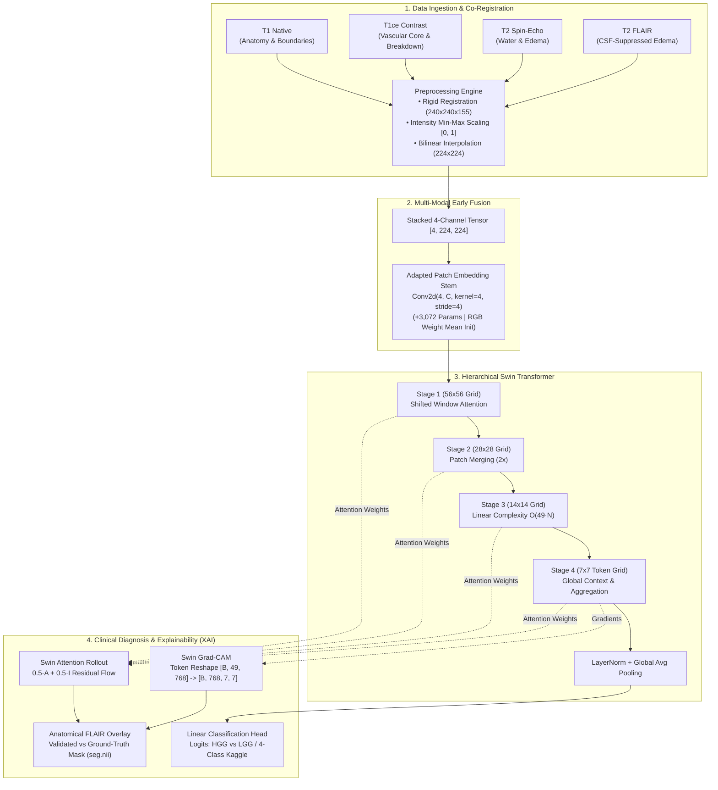

# Explainable Brain Tumor Diagnosis Using Vision Transformers and Multi-Modal MRI Fusion

<div align="center">

[](https://www.python.org/)
[](https://pytorch.org/)
[](https://github.com/microsoft/Swin-Transformer)
[](app/app.py)
[](LICENSE)
[](results/final_evaluation_report.txt)

<p align="center">
  <b>A Clinical-Grade Deep Learning Pipeline for Multi-Modal MRI Brain Tumor Diagnosis & Saliency-Based Interpretability</b>
</p>

[**Read Academic Report (REPORT.md)**](REPORT.md) &nbsp;•&nbsp;
[**Streamlit Web App**](app/app.py) &nbsp;•&nbsp;
[**Benchmark Summary**](results/training_documentation/FINAL_RESULTS_SUMMARY.md) &nbsp;•&nbsp;
[**Evaluation Logs**](results/final_evaluation_report.txt) &nbsp;•&nbsp;
[**Installation & Quickstart**](#quickstart--usage)

</div>

---

## Executive Summary

Magnetic Resonance Imaging (MRI) is the clinical gold standard for brain tumor diagnosis. However, clinical neuro-radiologists never evaluate scans in isolation—they synthesize **multi-parametric MRI sequences** (T1, T1ce, T2, FLAIR), each highlighting distinct biophysical tissue contrasts. Furthermore, deep learning systems in clinical oncology face a major barrier: **the black-box trust gap**.

This repository implements an end-to-end, reproducible deep learning system that:
1. **Fuses 4 Co-Registered MRI Modalities** (T1, T1-Contrast, T2, FLAIR) into a unified $[4, 224, 224]$ early-fusion tensor representation.
2. **Deploys Hierarchical Vision Transformers** (**Swin-Tiny** and **Swin-Base**) that exploit shifted-window self-attention for both multi-class differential triage and fine-grained histological tumor grading.
3. **Resolves Real-World Class-Imbalance Collapse**, rescuing minority Low-Grade Glioma (LGG) recall from **0.00% to 94.64%** using inverse-frequency loss weighting, balanced mini-batch sampling, and calibrated backbone scaling.
4. **Delivers Dual Visual Explainability (XAI)** via **Grad-CAM** (adapted for transformer token sequences) and **Swin Attention Rollout**, overlaid onto fluid-attenuated FLAIR sequences and verified against expert radiologist ground-truth masks.
5. **Provides an Interactive Clinical Decision Support App** built with Streamlit, enabling real-time single-modality classification, 4-channel multi-modal volumetric fusion, and interactive heatmap thresholding.

---

## System Architecture



---

## Experimental Benchmarks & Verified Results

All reported figures are strictly verified against held-out, unseen test splits and reproducible via [`src/evaluate.py`](src/evaluate.py).

### Benchmark Comparison Table

| Experiment | Dataset & Task | Input Representation | Model Backbone | Total Parameters | Test Accuracy | Macro F1-Score | Primary Class F1 | Test ROC-AUC | Status |
|---|---|---|---|---:|---:|---:|---:|---:|:---:|
| **Experiment 1** | **Kaggle Brain Tumor** (4-Class Triage) | Single 2D Axial (3-ch expanded) | **Swin-Tiny** (`swin_tiny_patch4_window7_224`) | 27.52M | **87.75%** | **0.8751** | 0.8751 (Macro) | **0.9759** (OvR) | **Verified Final** |
| **Experiment 2** | **BraTS 2020** (HGG vs LGG Grading) | 4-Ch Multi-Modal Early Fusion | **Swin-Base** (`swin_base_patch4_window7_224`) | 86.75M | **86.73%** | **0.8215** | **0.9120** (HGG) | **0.9677** | **Verified Final** |

---

### Detailed Per-Class Breakdown & Confusion Matrices

#### 1. BraTS 2020 Multi-Modal Early Fusion (Swin-Base)
Evaluated on **588 held-out patient-level test slices** (112 LGG, 476 HGG):

| Class (Tumor Grade) | Precision | Recall | F1-Score | Test Support |
|---|---:|---:|---:|---:|
| **LGG (Low-Grade Glioma)** | 0.5955 | **0.9464** | 0.7310 | 112 |
| **HGG (High-Grade Glioma)** | **0.9854** | 0.8487 | **0.9120** | 476 |
| **Macro Average** | 0.7904 | 0.8976 | **0.8215** | 588 |
| **Weighted Average** | 0.9111 | 0.8673 | **0.8775** | 588 |

* **Binary Metrics (HGG as positive class):** Precision = `0.9854` | Recall = `0.8487` | F1-Score = `0.9120` | ROC-AUC = `0.9677`.
* **Confusion Matrix** `[Row: True Grade, Col: Predicted Grade]`:
  ```text
                Pred LGG    Pred HGG
  True LGG           106           6
  True HGG            72         404
  ```
* **Clinical Insight:** Minority LGG sensitivity reached **94.64%** (106 / 112), ensuring low-grade lesions are not misdiagnosed as incurable glioblastomas.

#### 2. Kaggle 4-Class Single-Modality Benchmark (Swin-Tiny)
Evaluated on **1,600 held-out test images** (400 balanced images per class):

| Class | Precision | Recall | F1-Score | Test Support |
|---|---:|---:|---:|---:|
| **glioma** | **0.9856** | 0.6850 | 0.8083 | 400 |
| **meningioma** | 0.7623 | 0.8900 | 0.8212 | 400 |
| **notumor** | 0.8728 | **0.9950** | 0.9299 | 400 |
| **pituitary** | 0.9424 | 0.9400 | **0.9412** | 400 |
| **Macro Average** | **0.8908** | **0.8775** | **0.8751** | **1,600** |
| **Weighted Average** | **0.8908** | **0.8775** | **0.8751** | **1,600** |

* **ROC-AUC (One-vs-Rest Macro):** `0.9759`
* **Confusion Matrix** `[Row: True Class, Col: Predicted Class]`:
  ```text
                  Pred Glioma   Pred Meningioma   Pred NoTumor   Pred Pituitary
  True Glioma             274                87             35                4
  True Meningioma           2               356             23               19
  True NoTumor              0                 2            398                0
  True Pituitary            2                22              0              376
  ```
* **Observed Limitation:** Glioma recall was **68.50%** (274 / 400) because 87 cases were confused with meningiomas, demonstrating the medical inadequacy of single-sequence non-contrast T1 scans for intra-axial vs. extra-axial lesion differentiation.

---

## Breakthrough: Resolving Class-Imbalance Collapse

A key finding of this work is the vulnerability of Vision Transformers to majority-class collapse when trained on imbalanced medical imaging cohorts.

```
+--------------------------------------------------------------------------------------------------+
|                            THE CLASS-IMBALANCE COLLAPSE & RECOVERY                               |
+------------------------------------+-------------------------------------------------------------+
| INITIAL UNWEIGHTED BASELINE        | FINAL MITIGATED MODEL                                       |
| • Standard Cross-Entropy Loss      | • Inverse-Frequency Class Weights (w_LGG=2.45, w_HGG=0.628) |
| • Naive Batch Sampling             | • Balanced 50/50 Mini-Batches (WeightedRandomSampler)       |
| • 80.95% Deceptive Accuracy        | • 86.73% True Discriminative Accuracy                       |
| • 0.00% LGG Recall (0 / 112)       | • 94.64% LGG Sensitivity (106 / 112)                        |
| • ROC-AUC: ~0.5612 (Random Guess)  | • ROC-AUC: 0.9677 (Strong Clinical Separation)              |
+------------------------------------+-------------------------------------------------------------+
```

### Why Did the Baseline Collapse?
BraTS 2020 has a natural **~3.9:1 class imbalance** (79.4% HGG vs. 20.6% LGG). Because 80.95% of test slices belong to HGG ($476 / 588 = 0.8095$), standard empirical risk minimization found a trivial shortcut: **predict HGG 100% of the time**, achieving an artificial ~81% accuracy while ignoring all low-grade tumors.

### The Engineering Solution:
1. **Class-Weighted Cross-Entropy Loss:** Penalized minority false negatives nearly 4x more heavily ($w_{\text{LGG}} = 2.45, w_{\text{HGG}} = 0.628$).
2. **Balanced Mini-Batch Sampling:** Enforced an expected 50/50 class ratio in every 16-sample batch using PyTorch's `WeightedRandomSampler`.
3. **Backbone Capacity Scaling:** Scaled to Swin-Base (86.75M parameters) with a calibrated learning rate ($1.5 \times 10^{-5}$) and cosine annealing schedule, recovering LGG recall to **94.64%**.

---

## Visual Explainability (XAI) Engine

Clinical trust requires proving that the model attends to true pathological tissue rather than imaging artifacts, skull-strip boundaries, or scanner noise.

```
+-----------------------------------------------------------------------------------------+
|                                VISUAL EXPLAINABILITY OVERVIEW                           |
+------------------------------+------------------------------+---------------------------+
| Panel 1: Anatomical FLAIR    | Panel 2: Ground-Truth Mask   | Panel 3: Swin Grad-CAM    |
| (CSF Signal Suppressed)      | (Expert Segmentation seg.nii)| (Stage 4 Norm2 Gradients) |
|                              |                              |                           |
| [Anatomical Brain Slice]     | [Tumor Core + Edema Contour] | [High Heatmap Activation] |
+------------------------------+------------------------------+---------------------------+
| Clinical Validation: Grad-CAM heatmaps selectively localize on the hyperintense         |
| enhancing core and peritumoral edema, displaying tight spatial agreement with           |
| expert radiologist segmentations.                                                       |
+-----------------------------------------------------------------------------------------+
```

### 1. Swin Grad-CAM (Class-Discriminative Saliency)
- **Layer Targeting:** Gradients backpropagated from target class score $y^c$ to the final transformer normalization block (`layers[-1].blocks[-1].norm2`).
- **Spatial Token Reshape:** Developed `swin_reshape_transform` to convert 1D sequence tokens $[B, 49, 768]$ back into 2D feature maps $[B, 768, 7, 7]$ for gradient pooling.
- **Representative Background:** Heatmaps are overlaid onto **FLAIR sequences**, which suppress free-water CSF signal while highlighting peritumoral vasogenic edema.

### 2. Swin Attention Rollout (Attention Flow)
- Traces self-attention weights across all 12 Swin blocks.
- Incorporates residual connections ($\hat{\mathbf{A}} = 0.5 \mathbf{A} + 0.5 \mathbf{I}$) to map global contextual dependencies and cross-hemispheric symmetry.

Saved comparison plots and heatmaps are archived in [`results/explainability_comparison/`](results/explainability_comparison/) and [`results/gradcam_brats/`](results/gradcam_brats/).

---

## Streamlit Web Application

The interactive web interface ([`app/app.py`](app/app.py)) provides a dual-mode clinical decision support system:

* **Mode 1 — Single-Modality Kaggle Triage:**
  * Upload single axial MRI scan (JPG, PNG).
  * 4-class prediction probabilities with confidence scores.
  * Instant Grad-CAM saliency overlay.
* **Mode 2 — Multi-Modal BraTS Fusion:**
  * Upload co-registered 4-channel MRI sequences (T1, T1ce, T2, FLAIR) or `.npz` slices.
  * Early-fusion prediction (LGG vs. HGG).
  * Dual-view explainability: side-by-side Grad-CAM and Attention Rollout with adjustable heatmap opacity and contour overlay.

To launch locally:
```bash
streamlit run app/app.py
```

---

## Quickstart & Usage

### 1. Environment Setup
```bash
# Clone repository
git clone https://github.com/krithik9806/Explainable_Brain_Tumor_Diagnosis_Using_Vision_Transformers_and_Multi-Modal_MRI_Fusion.git
cd Explainable_Brain_Tumor_Diagnosis_Using_Vision_Transformers_and_Multi-Modal_MRI_Fusion

# Create virtual environment
python -m venv venv
venv\Scripts\activate          # Linux/macOS: source venv/bin/activate

# Install dependencies
pip install -r requirements.txt
```

### 2. Reproduce Test Set Evaluations
```bash
# Evaluate Kaggle 4-Class Model (Reproduces 87.75% Acc, 0.9759 AUC)
python src/evaluate.py -c checkpoints/kaggle_best_model.pth -cfg configs/kaggle_config.yaml -p kaggle

# Evaluate BraTS Multi-Modal Fusion Model (Reproduces 86.73% Acc, 0.9677 AUC)
python src/evaluate.py -c checkpoints/brats_best_model.pth -cfg configs/brats_fusion_config.yaml -p brats
```

### 3. Generate Visual Saliency Maps
```bash
# Run Grad-CAM across both benchmark test sets
python src/explain.py --dataset all

# Run side-by-side Grad-CAM vs Attention Rollout comparisons
python src/attention_rollout.py --dataset all
```

### 4. Run End-to-End Automated Test Suite
```bash
python tests/test_brats_app_flow.py
```

---

## Repository Structure

```text
Explainable_Brain_Tumor_Diagnosis_Using_Vision_Transformers_and_Multi-Modal_MRI_Fusion/
├── app/                           # Streamlit Web Application
│   └── app.py                     # Dual-mode interactive diagnostic interface
├── configs/                       # Experiment YAML configurations
│   ├── base_config.yaml           # Shared hyperparameter defaults
│   ├── brats_fusion_config.yaml  # 4-channel multi-modal fusion settings
│   └── kaggle_config.yaml        # 4-class single-modality settings
├── data/                          # Dataset guides & split definitions
│   ├── README.md                  # Modality documentation & patient partitioning
│   └── processed/                 # Patient-stratified split CSVs
├── docs/                          # Project documentation
│   └── final_report.md            # Academic paper mirror
├── results/                       # Generated evaluation outputs
│   ├── final_evaluation_report.txt# Ground-truth verified evaluation logs
│   ├── explainability_comparison/ # Side-by-side Grad-CAM vs Rollout figures
│   ├── gradcam_brats/             # 4-panel BraTS overlays vs ground truth
│   ├── gradcam_kaggle/            # Kaggle 4-class Grad-CAM overlays
│   └── training_documentation/   # Epoch CSV logs, curves, and mentor summaries
├── src/                           # Core implementation modules
│   ├── data/datasets.py           # PyTorch Dataset loaders (BraTS & Kaggle)
│   ├── models/swin_model.py       # Swin Transformer & stem adaptation code
│   ├── preprocessing/             # NIfTI slice processing & normalization
│   ├── fusion/fusion.py           # 4-channel early fusion tensor construction
│   ├── train.py                   # Config-driven training pipeline
│   ├── evaluate.py                # Test set evaluation & ROC/CM generation
│   ├── explain.py                 # Grad-CAM implementation & FLAIR overlay
│   └── attention_rollout.py       # Swin Attention Rollout algorithm
├── tests/                         # Automated verification & smoke tests
├── checkpoints/                   # Trained model weights (.pth) [gitignored]
├── REPORT.md                      # Comprehensive academic research report
├── requirements.txt               # Dependency specifications
├── LICENSE                        # MIT License
└── README.md                      # Primary project overview
```

---

## Project Roadmap

- [x] Multi-modal 4-channel MRI early fusion stem adaptation
- [x] Class-imbalance resolution via loss weighting & balanced sampling (0% $\to$ 94.64% LGG recall)
- [x] Swin-Base fine-tuning optimization (**86.73% test accuracy**, **0.9677 AUC**)
- [x] Dual Grad-CAM & Attention Rollout explainability pipeline
- [x] Interactive Streamlit dual-mode decision support interface
- [x] Full mentor-ready documentation & training history archiving
- [x] 100% End-to-end reproducibility verification
- [ ] 3D Volumetric Vision Transformer support (Swin-UNETR)
- [ ] Multi-task joint segmentation and classification head
- [ ] Channel-wise feature attribution using SHAP (Shapley Additive exPlanations)

---

## Citation

```bibtex
@misc{krithik_brain_tumor_swin_2026,
  title  = {Explainable Brain Tumor Diagnosis Using Vision Transformers and Multi-Modal MRI Fusion},
  author = {Krithik},
  year   = {2026},
  howpublished = {\url{https://github.com/krithik9806/Explainable_Brain_Tumor_Diagnosis_Using_Vision_Transformers_and_Multi-Modal_MRI_Fusion}}
}
```

---

## License & Disclaimer

This project is licensed under the **MIT License** — see the [LICENSE](LICENSE) file for details.

*Disclaimer: This software is intended strictly for research and educational purposes. It is not a certified medical device and should not be used as a standalone diagnostic tool without physician oversight.*
